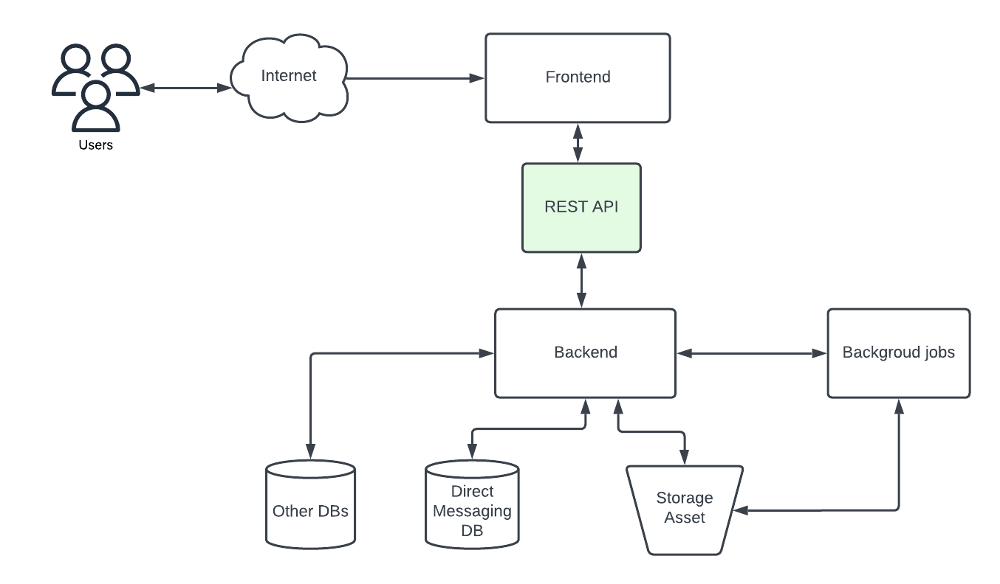
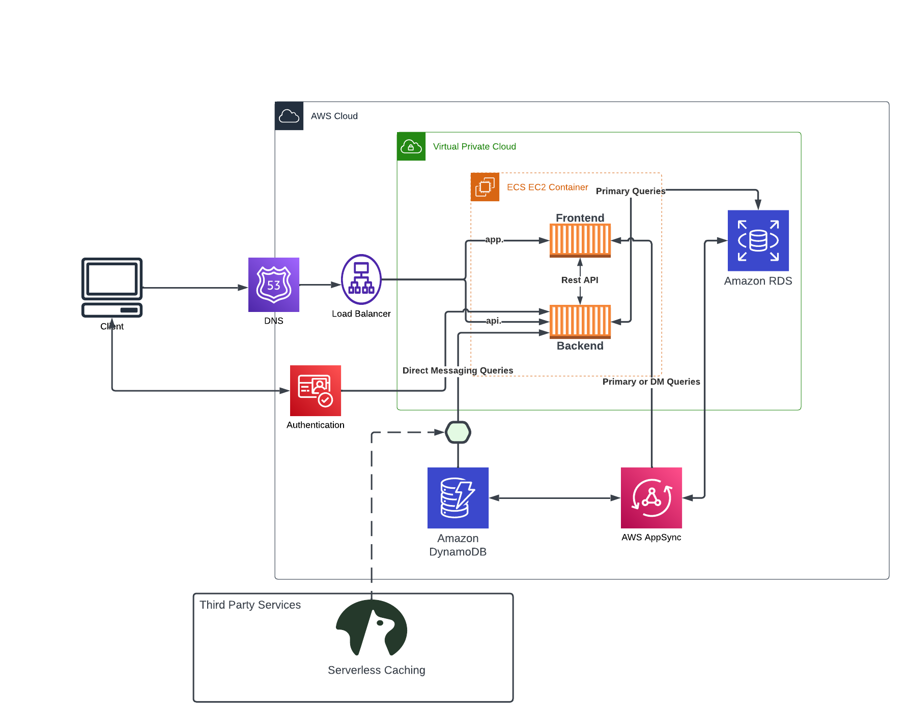

# Week 0 — Billing and Architecture

## Required Homework/Tasks

### Contextual Diagram

[Lucid Charts Contextual Diagram Share Link](https://lucid.app/lucidchart/4dde6345-af3f-4100-ab6a-fc4c634871a5/edit?viewport_loc=-10%2C30%2C1707%2C733%2CTkKxJvZj99NX&invitationId=inv_c42b5846-0bf8-4d99-9248-154bfaf62673)

### Logical Digram

[Lucid Charts Contextual Diagram Share Link](https://lucid.app/lucidchart/4dde6345-af3f-4100-ab6a-fc4c634871a5/edit?viewport_loc=-319%2C30%2C2560%2C1100%2C0_0&invitationId=inv_c42b5846-0bf8-4d99-9248-154bfaf62673)