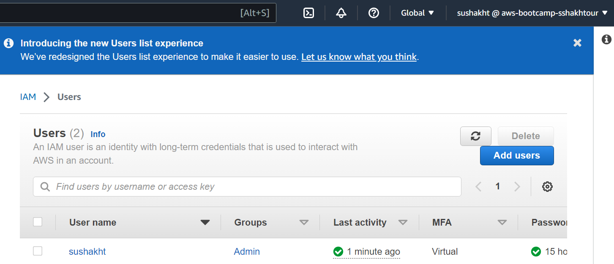
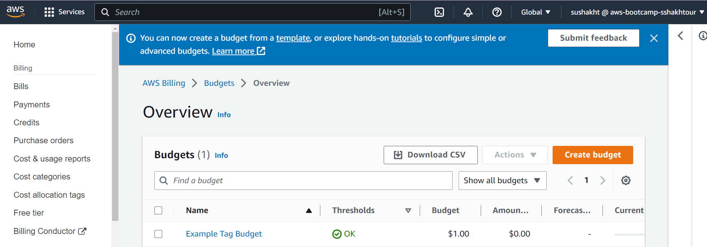

# Week 0 — Billing and Architecture

## Required Homework/Tasks

### Contextual Diagram


[Lucid Charts Contextual Diagram Share Link](https://lucid.app/lucidchart/4dde6345-af3f-4100-ab6a-fc4c634871a5/edit?viewport_loc=-10%2C30%2C1707%2C733%2CTkKxJvZj99NX&invitationId=inv_c42b5846-0bf8-4d99-9248-154bfaf62673)

### Logical Digram


[Lucid Charts Logical Diagram Share Link](https://lucid.app/lucidchart/4dde6345-af3f-4100-ab6a-fc4c634871a5/edit?viewport_loc=-319%2C30%2C2560%2C1100%2C0_0&invitationId=inv_c42b5846-0bf8-4d99-9248-154bfaf62673)

### Create Admin User

I created Admin user called sushakht from AWS Console IAM with permission AdministratorAccess by following these steps:

- Go to [IAM Users Console](https://us-east-1.console.aws.amazon.com/iamv2/home?region=us-east-1#/users) create a new user
- `Enable console access` for the user
- Create a new `Admin` Group and apply `AdministratorAccess`



### Generate AWS Credentials

- Find the user from Go to [IAM Users Console](https://us-east-1.console.aws.amazon.com/iamv2/home?region=us-east-1#/users) then click into the user
- Click on `Security Credentials` and `Create Access Key`
- Choose AWS CLI Access
- Download the CSV with the credentials to use them in the next steps


### Install AWS CLI

- We are going to install the AWS CLI when our Gitpod enviroment lanuches.
- We are are going to set AWS CLI to use partial autoprompt mode to make it easier to debug CLI commands.
- The bash commands we are using are the same as the [AWS CLI Install Instructions](https://docs.aws.amazon.com/cli/latest/userguide/getting-started-install.html)


Update our `.gitpod.yml` to include the following task.

```sh
tasks:
  - name: aws-cli
    env:
      AWS_CLI_AUTO_PROMPT: on-partial
    init: |
      cd /workspace
      curl "https://awscli.amazonaws.com/awscli-exe-linux-x86_64.zip" -o "awscliv2.zip"
      unzip awscliv2.zip
      sudo ./aws/install
      cd $THEIA_WORKSPACE_ROOT
```

We'll also run these commands indivually to perform the install manually

### Set Env Vars

We will set these credentials for the current bash terminal
```
export AWS_ACCESS_KEY_ID=""
export AWS_SECRET_ACCESS_KEY=""
export AWS_DEFAULT_REGION=""
```

We'll tell Gitpod to remember these credentials if we relaunch our workspaces
```
gp env AWS_ACCESS_KEY_ID=""
gp env AWS_SECRET_ACCESS_KEY=""
gp env AWS_DEFAULT_REGION=""
```

### Check that the AWS CLI is working and you are the expected user

```sh
aws sts get-caller-identity
```

You should see something like this:
```json
{
    "UserId": "[UserID]",
    "Account": "[Account]",
    "Arn": "arn:aws:iam::[account_id]:user/[user]"
}
```

Below is the output


## Enable Billing 

We need to turn on Billing Alerts to recieve alerts...


- In your Root Account go to the [Billing Page](https://console.aws.amazon.com/billing/)
- Under `Billing Preferences` Choose `Receive Billing Alerts`
- Save Preferences


## Creating a Billing Alarm

### Create SNS Topic

- We need an SNS topic before we create an alarm.
- The SNS topic is what will delivery us an alert when we get overbilled
- [aws sns create-topic](https://docs.aws.amazon.com/cli/latest/reference/sns/create-topic.html)

We'll create a SNS Topic
```sh
aws sns create-topic --name billing-alarm
```
which will return a TopicARN

We'll create a subscription supply the TopicARN and our Email
```sh
aws sns subscribe \
    --topic-arn TopicARN \
    --protocol email \
    --notification-endpoint your@email.com
```

Check your email and confirm the subscription

#### Create Alarm

- [aws cloudwatch put-metric-alarm](https://docs.aws.amazon.com/cli/latest/reference/cloudwatch/put-metric-alarm.html)
- [Create an Alarm via AWS CLI](https://aws.amazon.com/premiumsupport/knowledge-center/cloudwatch-estimatedcharges-alarm/)
- We need to update the configuration json script with the TopicARN we generated earlier
- We are just a json file because --metrics is is required for expressions and so its easier to us a JSON file.

```sh
aws cloudwatch put-metric-alarm --cli-input-json file://aws/json/alarm_config.json
```
To validate creationg of alarm, from aws counsole search for [CloudWatch](https://us-east-1.console.aws.amazon.com/cloudwatch/home?region=us-east-1#alarmsV2:?) from there you should see the created alarm


## Create an AWS Budget

[aws budgets create-budget](https://docs.aws.amazon.com/cli/latest/reference/budgets/create-budget.html)

Get your AWS Account ID
```sh
aws sts get-caller-identity --query Account --output text
```

- Supply your AWS Account ID
- Update the json files
- This is another case with AWS CLI its just much easier to json files due to lots of nested json

```sh
aws budgets create-budget \
    --account-id AccountID \
    --budget file://aws/json/budget.json \
    --notifications-with-subscribers file://aws/json/budget-notifications-with-subscribers.json
```
To validate creation of budget, from aws console search for [AWS Budgett](https://us-east-1.console.aws.amazon.com/billing/home?region=us-east-1#/budgets/overview) below is the prove of budget creation



